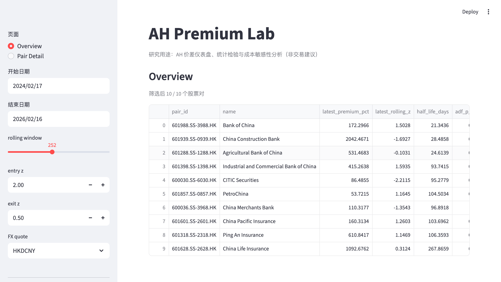
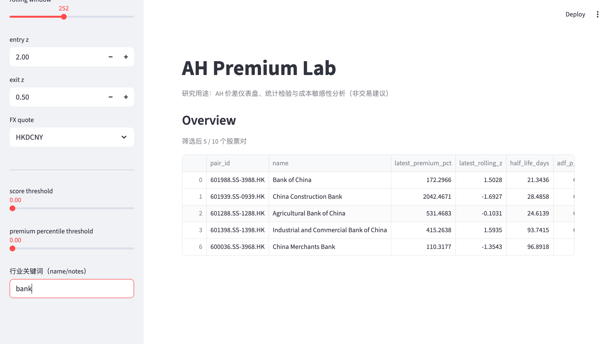
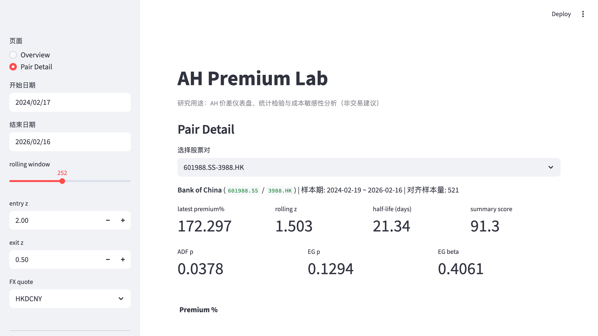
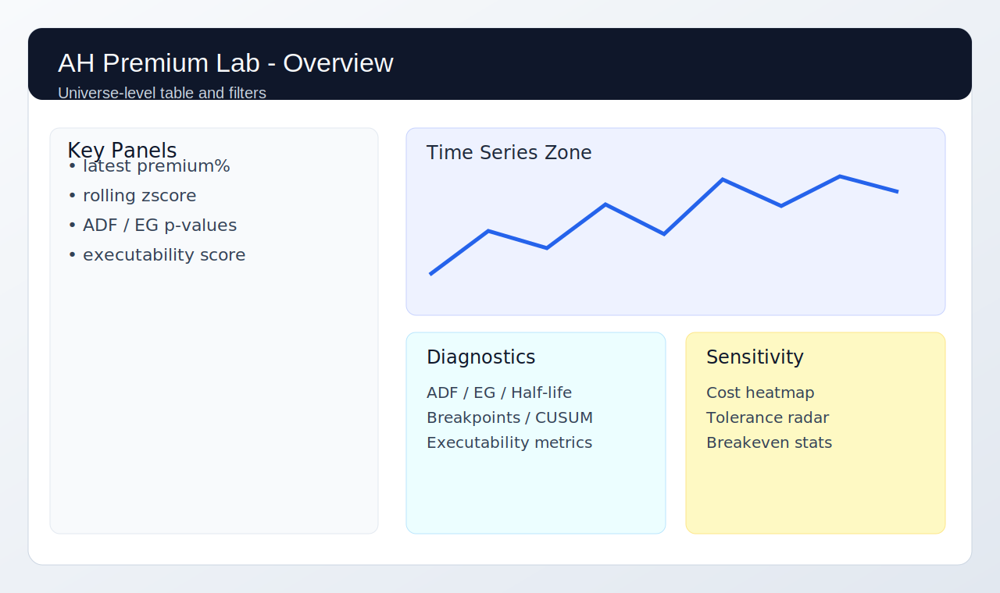
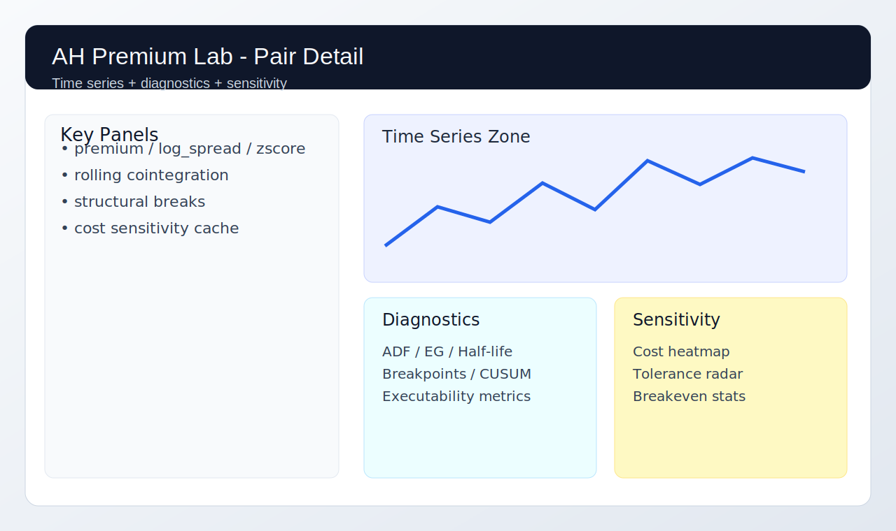

# ah-premium-lab

> A/H 溢价研究实验室（研究/作品集用途）
>
> `ah-premium-lab` 提供一套可复现的研究工程：
> - Streamlit 仪表盘（Overview + Pair Detail）
> - 统计检验（ADF / Engle-Granger / 半衰期 / rolling 协整 / 结构突变）
> - 研究策略回测（含可执行性约束）
> - 成本敏感性扫描与 HTML 报告（含成本容忍度雷达图）

## 重要声明

- 本项目仅用于研究与展示，不接任何实盘下单。
- 不包含券商 API 执行，不构成投资建议。
- 回测与统计结果不保证未来收益。

---

## 在线入口（占位）

- GitHub Pages 主页（启用后）：
  `https://<YOUR_GITHUB_USERNAME>.github.io/AH-Diff-Dashboard/`
- Pages 示例报告（相对路径）：
  `/reports/cost_sensitivity_demo.html`

---

## 上一版本截图（真实运行）

> 以下为上一版本本地运行时的真实 PNG 截图，用于说明页面结构与核心信息布局。

### 1) Overview（全市场概览）



说明：
- 展示 universe 级别的 `latest premium% / rolling z / ADF p / EG p / summary score`。
- 可联动数据质量字段（`coverage% / max_gap_days / outlier_count`）。
- 适合快速筛选“值得进一步研究”的 AH pair。

### 2) Overview（筛选态）



说明：
- 体现关键词筛选、阈值筛选后的候选集。
- 可用于演示“从全市场到候选池”的研究流程。

### 3) Pair Detail（单对详情）



说明：
- 展示 `premium% / log_spread / rolling zscore` 时序。
- 显示统计检验、样本期、缺失警告、rolling 协整指标。
- 可查看结构突变断点和成本敏感性结果。

---

## 当前版本 Demo 资产（自动生成）

> 以下 SVG 可通过脚本自动生成，适用于仓库首屏展示与 CI 产物。





生成命令：

```bash
python scripts/make_demo_assets.py
```

---

## 功能总览

| 模块 | 能力 | 说明 |
|---|---|---|
| `data/` | 数据模型与 Provider | `PriceSeries` / `FxSeries` / `AhPair`，支持缓存与完整性检查 |
| `core/` | A/H 溢价口径计算 | `premium_pct`、`log_spread`、rolling zscore、rolling percentile |
| `stats/` | 统计检验 | ADF、Engle-Granger、半衰期、rolling 协整、结构突变 |
| `backtest/` | 研究策略与成本模型 | 日频策略、可执行性约束、双边成本、borrow 场景 |
| `report/` | 研究报告生成 | 单页/多页 HTML，含敏感性热力图与雷达图 |
| `app/` | Streamlit Dashboard | Overview + Pair Detail，支持缓存与筛选 |
| `tests/` | 单元测试 + 回归测试 | pytest + golden metrics 机制 |

---

## 项目结构

```text
ah-premium-lab/
├── .github/
│   └── workflows/
│       └── ci-pages.yml
├── .env.example
├── .dockerignore
├── Dockerfile
├── docker-compose.yml
├── config/
│   └── default.yaml
├── data/
│   ├── cache/
│   ├── mapping_overrides.csv
│   ├── pairs.csv
│   └── pairs_master.csv
├── docs/
│   ├── index.html
│   ├── reports/
│   └── screenshots/
├── scripts/
│   ├── make_demo_assets.py
│   └── build_pages_report.py
├── src/
│   └── ah_premium_lab/
│       ├── app/
│       ├── backtest/
│       ├── core/
│       ├── data/
│       ├── report/
│       ├── stats/
│       ├── universe/
│       ├── cli.py
│       └── config.py
└── tests/
```

---

## 快速开始

### 方式 A：本地 Python 环境

```bash
python -m venv .venv
source .venv/bin/activate
pip install -e .[dev]
```

运行检查：

```bash
python -m ruff check .
PYTHONPATH=src pytest -q
```

### 方式 B：Docker 一键启动 Dashboard

```bash
docker compose up --build
```

访问：`http://localhost:8501`

---

## 本地一键演示产物（docs）

```bash
python scripts/make_demo_assets.py
PYTHONPATH=src python scripts/build_pages_report.py
```

会生成：
- `docs/index.html`
- `docs/reports/cost_sensitivity_demo.html`
- `docs/screenshots/*_demo.svg`

---

## Dashboard 使用说明

启动：

```bash
PYTHONPATH=src streamlit run src/ah_premium_lab/app/streamlit_app.py
```

### Overview 页面

可查看并筛选：
- 估值指标：`latest premium%`、`latest rolling z`、`half_life_days`
- 统计检验：`adf_p_value`、`eg_p_value`、`summary_score`
- 数据质量：`coverage_pct`、`max_gap_days`、`outlier_count`、`data_quality_score`
- 可执行性：`executability_score`、`missed_trades`、`constraint_violation_count`

### Pair Detail 页面

展示：
- 时序图：`premium_pct`、`log_spread`、`rolling_zscore`
- rolling 协整：`rolling p-value`、`rolling beta`
- 结构突变：breakpoints + CUSUM 指标
- 成本敏感性：缓存热力图与明细表

---

## 报告生成（CLI）

### Single HTML

```bash
PYTHONPATH=src python -m ah_premium_lab.report.generate_report \
  --start 2024-01-01 \
  --end 2025-12-31 \
  --pairs-csv data/pairs.csv \
  --cache-dir data/cache \
  --window 252 \
  --entry 2.0 \
  --exit 0.5 \
  --commission-min 0 --commission-max 10 --commission-step 2 \
  --slippage-min 0 --slippage-max 20 --slippage-step 5 \
  --stamp-min 0 --stamp-max 15 --stamp-step 5 \
  --output outputs/ah_research_report.html \
  --mode single
```

### Multi-page HTML

```bash
PYTHONPATH=src python -m ah_premium_lab.report.generate_report \
  --start 2024-01-01 \
  --end 2025-12-31 \
  --pairs 601318.SS-2318.HK,600036.SS-3968.HK \
  --output outputs/ah_research_report_multi \
  --mode multi
```

输出：
- `single`: `outputs/ah_research_report.html`
- `multi`: `outputs/ah_research_report_multi/index.html` + `pairs/*.html`

---

## 数据源与口径

默认数据源：
- 价格与汇率：`yfinance`（Yahoo Finance）

核心口径：
- `premium_pct = A / (H * fx_hkd_to_cny * share_ratio) - 1`
- `log_spread = log(A) - log(H * fx_hkd_to_cny * share_ratio)`

其中：
- A 端为 CNY
- H 端为 HKD，经 FX 折算为 CNY 后比较
- 支持 `HKDCNY` 与 `CNYHKD` 两种汇率输入

---

## 方法学与实现细节

### 1) 统计检验

`stats/diagnostics.py`：
- `adf_test(series)`
- `engle_granger_test(log_A, log_H_fx)`
- `half_life_ar1(series)`
- `summary_score(...)`

`stats/rolling.py`：
- rolling Engle-Granger（窗口 + 步长）
- 稳定性指标：p-value 通过率、beta 方差、残差波动漂移

`stats/breaks.py`：
- 结构突变检测（rolling mean-shift + Welch t-test + CUSUM）
- 输出断点日期与置信度

### 2) 策略与可执行性

`backtest/pairs_strategy.py`（研究版规则）：
- `z > entry`: short spread（卖 A 买 H）
- `z < -entry`: long spread（买 A 卖 H）
- `|z| < exit`: 平仓

`backtest/executability.py` 约束：
- `enforce_a_share_t1=True`: A 股 T+1 最短持有约束
- `allow_short_a=False`: 禁止做空 A 股
- `allow_short_h=True/False`: H 股做空开关

输出执行性指标：
- `missed_trades`
- `constraint_violation_count`
- `effective_turnover`
- `executability_score (0-100)`

### 3) 成本模型（升级版）

`backtest/costs.py` 支持：
- A/H 双腿成本独立
- 买卖双边拆分：commission / stamp / slippage
- `borrow_bps` 占位参数（年化，默认 0）

`sensitivity.py` 新增关键结果：
- `breakeven_slippage`
- `breakeven_total_cost`
- `worst_case_net_dd`

报告新增：
- 成本容忍度雷达图
- 成本容忍度摘要表

---

## Universe 与数据质量

- `data/pairs_master.csv`: 大 universe（50+）
- `data/pairs.csv`: 小样本回退
- `data/mapping_overrides.csv`: ticker 拉取失败人工修正表

质量指标：
- `coverage_pct`
- `max_gap_days`
- `outlier_count`
- `data_quality_score`

缺失率超过阈值（例如 20%）会在 Overview 中标红并降分。

---

## 研究回归测试（Golden Metrics）

固定夹具路径：
- `tests/fixtures/research_regression/pairs.csv`
- `tests/fixtures/research_regression/params.yaml`
- `tests/fixtures/research_regression/golden_metrics.json`

运行：

```bash
PYTHONPATH=src pytest -q tests/test_research_regression.py
```

用于校验关键指标在容忍范围内保持一致，防止研究结果悄然漂移。

---

## CI/CD 与 GitHub Pages

工作流：`.github/workflows/ci-pages.yml`

触发：
- push 到 `main`
- 手动 `workflow_dispatch`

流水线步骤：
1. 安装依赖
2. 运行 `pytest -q`
3. 生成 `docs/` 演示资产与示例报告
4. 发布到 GitHub Pages

### 启用 Pages（仓库设置）

1. GitHub 仓库进入 `Settings` → `Pages`
2. `Build and deployment` 选择 `GitHub Actions`
3. push 到 `main` 等待 workflow 完成
4. 访问 Pages URL

---

## 安全与环境变量

- 默认不需要任何密钥即可运行基础研究流程。
- `.env.example` 仅作模板，不包含真实 Token。
- 请勿把任何私有凭据写入代码或提交到仓库。

---

## 常见问题

### 1) `ModuleNotFoundError: ah_premium_lab`

请使用：

```bash
PYTHONPATH=src pytest -q
```

或安装为 editable：

```bash
pip install -e .[dev]
```

### 2) parquet 写入失败（缺少引擎）

安装 `pyarrow`：

```bash
pip install pyarrow
```

### 3) yfinance 拉取失败

- 检查网络
- 稍后重试
- 查看 `data/mapping_overrides.csv` 是否需要人工修正 ticker

---

## 参考链接（真实性与口径）

- 恒生沪深港通 AH 股溢价指数 Factsheet（HSAHP）：
  [fs_hsahp.pdf](https://www.hsi.com.hk/static/uploads/contents/en/dl_centre/factsheets/fs_hsahp.pdf)
- 上交所英文站 H50066 方法论文档：
  [H50066_h50066hbooken_EN.pdf](https://english.sse.com.cn/indices/indices/list/indexmethods/c/H50066_h50066hbooken_EN.pdf)

说明：本仓库使用公开定义做研究复现，不声称与官方指数编制细节逐项一致。

---

## 不做什么

- 不接实盘交易、不下单
- 不承诺收益
- 不替代投资顾问意见

---

## License

如未另行声明，默认按仓库后续添加的 License 文件执行。
