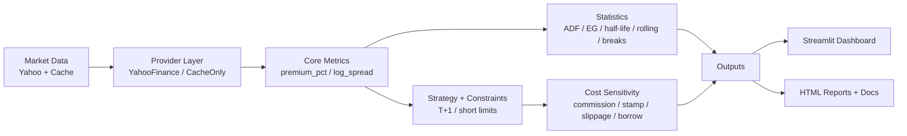

# AH-Diff-Dashboard One Pager

## 30 秒简介

`AH-Diff-Dashboard` 是一个面向研究与作品集展示的 AH 溢价分析项目。  
它把数据对齐、统计检验、可执行性约束和成本敏感性放在同一条可复现实验链路中，输出 Dashboard 与离线 HTML 报告。  
目标是回答一个实务问题：统计上“看起来有效”的价差，是否在成本与交易约束下仍有研究价值。

## 架构图

## 3 个关键工程点

1. 缓存与离线模式  
通过 `data/cache` 与 `OFFLINE=1` 保证无网络时仍可运行分析与 Demo 展示，降低外部数据源抖动对评审结果的影响。

2. 回归测试与结果稳定性  
使用 `tests/test_research_regression.py` + golden metrics 固化关键研究指标，避免重构后出现“悄然漂移”。

3. 成本敏感性与可执行性约束  
在回测链路中同时建模交易成本网格与执行约束（T+1、做空限制、missed trades），输出 breakeven 阈值而不是仅报告收益。

## Demo 链接

- Pages: [https://constantine-s-an.github.io/AH-Diff-Dashboard/](https://constantine-s-an.github.io/AH-Diff-Dashboard/)
- Report: [https://constantine-s-an.github.io/AH-Diff-Dashboard/reports/cost_sensitivity_demo.html](https://constantine-s-an.github.io/AH-Diff-Dashboard/reports/cost_sensitivity_demo.html)
